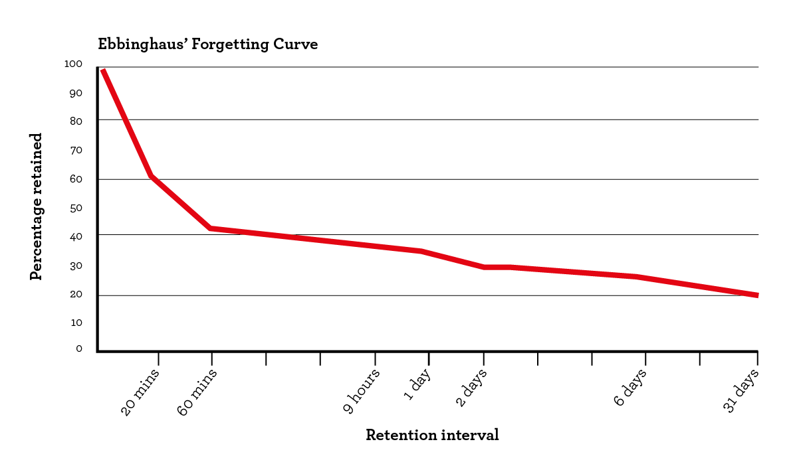
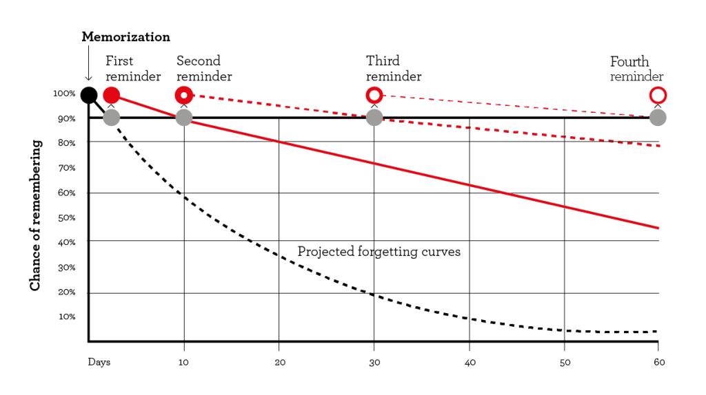

# Prorev

Prorev is a Notion Integration based on the gapped revision technique for better
retention of concepts.

> [Download The Client App for Windows here](https://drive.google.com/uc?export=download&id=1XzxzJMdJfErjaVR1IypWlfamvSKfYbbj)

## Description

Prorev is a Python project that integrates with Notion to improve learning and
memory retention. It utilizes the gapped revision method, a technique that
optimizes the revision process by spacing out reading sessions. By organizing
and rendering new reads based on this method along with perioding notifications,
Prorev helps users efficiently retain and reinforce concepts.

<div>


</div>

## Features

-   Reading Plan Generation: Users can select a time span to generate a Reading
    plan based on the gapped revision method optimizes for their time span.
-   Time Span Options: Users can select a time span to get a optimised reading
    plan for their span.
-   Timely Notifications: Prorev provides timely notifications for reads in the
    pending database, ensuring you stay on track with your learning goals.
-   Multi-Device Support: Subscribed users can receive notifications on up to 20
    devices, allowing you to stay connected across multiple platforms.

## Getting Started

To use Prorev and connect it to your Notion workspace, you'll need to obtain a
Notion Integration API token. Follow the instructions below to get your API
token:

1. Log in to your Notion account.
2. Navigate to the
   [Notion Integrations page](https://www.notion.so/my-integrations).
3. Create a new integration or select an existing one.
4. Generate an integration token and copy it.
5. Create a page that you want to use for your revision tracking.
6. Click on the three dots at the top right corner of the page. Find "Add
   Connections Button"
7. Add the integration you created to your page

## Usage

There are two ways in which you can use ProRev:

### 1. Client App

The Prorev project provides a user-friendly client that can be run on your local
machine. Follow the steps below to use the local client:

1. Download the Client App from
   [here](https://drive.google.com/uc?export=download&id=1XzxzJMdJfErjaVR1IypWlfamvSKfYbbj)
2. Open 'Prorev' dekstop app
3. Enter your Integration Token and the Page Name and activate the connection
4. Click on 'get notifications' to subscribe on the devices to get notifications
   for pending reads

### 2. Hosting on Cloud or To Run as a Script on local machine [Recommended]

If you want to host the Prorev project on a cloud platform for 24/7 rendering
and notification service, follow these steps:

1. Go to any cloud hostings of your choice, here are some free options:
    - [pythonanywere](https://www.pythonanywhere.com/)
    - [render.com](https://render.com/)
    - [railway.app](https://railway.app/)
2. Open Console
3. Clone the repository:
    ```
    git clone https://github.com/labhansh2/prorev.git
    ```
4. Enter the Root Directory of the project:
    ```
    cd prorev
    ```
5. Installing the dependencies:
    ```
    pip install -r requirements.txt
    ```
6. Run the script:

    ```
    python main.py
    ```

    ```
    options:
    -h, --help        show this help message and exit
    --debug           Enable debug logging level
    --info            Enable info logging level [DEFAULT]
    --error           Enable error logging level
    --warning         Enable warning logging level
    --new_connection  Erases Existing Connection For Creating a New Connection
    ```

7. Enter your integration token and the name of the page you created in Notion.
8. Subscribe for Notifications from the Notification Endpoint Link Displayed in
   the Console.

## ToDo

-   [ ] Optimize the code for least API calls to Notion API
-   [ ] Sign the client executable so windows doesn't dub it as a potential
        virus [imp]
-   [ ] Add Directions to Use in the Rendered Notion User Page
-   [ ] Replace Starter Functions in Main with Script and Processes to run from
        client using subprocess
-   [ ] Make Prorev a public notion integration to save users from the hassle of
        getting integration token and hosting

## Contributing

Contributions to Prorev are welcome! If you encounter any issues or have ideas
for improvements, please open an issue on the
[GitHub repository](https://www.github.com/labhansh2/prorev.git) or submit a
pull request. You can also refer #ToDo for ideas to contribute.
